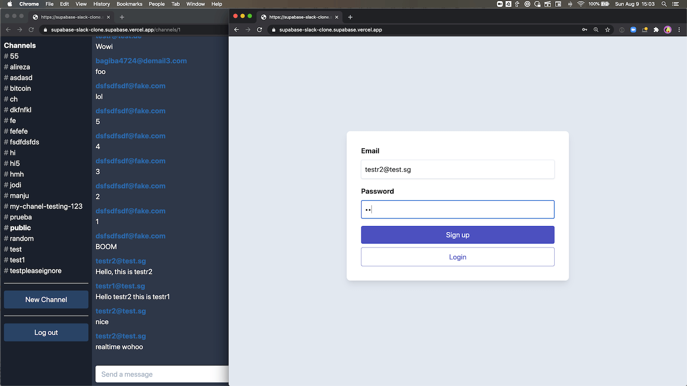

# 使用Supabase的实时聊天实例

这是一个全栈的Slack克隆例子，使用的是:

- 前端:
  - Next.js.
  - [Supabase.js](https://supabase.com/docs/library/getting-started) 用于用户管理和实时数据同步.
- 后端:
  - [app.supabase.com](https://app.supabase.com/): 带有restful API的托管Postgres数据库，用于Supabase.js的使用。.




## Deploy your own

### 1. 创建新项目

注册Supabase - [https://app.supabase.com](https://app.supabase.com) 并创建一个新项目。 等待你的数据库启动。

### 2. 运行 "Slack Clone "快速入门

一旦你的数据库启动，运行 "Slack Clone"快速入门。


### 3. 获取URL和密钥

进入项目设置（齿轮图标），打开API标签，并找到你的API URL和`anon`密钥。你将在下一步中需要这些。

`anon`密钥是你的客户端API密钥。它允许 "匿名访问 "你的数据库，直到用户登录。一旦他们登录了，密钥将切换到用户自己的登录令牌。这使你的数据实现了行级安全。阅读更多相关信息[如下］(#postgres-row-level-security).


**_NOTE_**: `service_role`密钥可以完全访问你的数据，绕过任何安全策略。这些密钥必须保密，而且要在服务器环境中使用，决不能在客户端或浏览器上使用。


### 4. 如有必要，改变认证设置


在[app.supabase.com](https://app.supabase.com)上，如果有必要，你可以进入认证->设置来改变你的项目的认证设置。在这里，你可以改变网站的URL，它用于确定在用户确认他们的电子邮件地址或试图使用魔法链接登录后重定向到哪里。

在这里，你也可以启用外部oauth提供商，如谷歌和GitHub。

## 如何使用

### Using `create-next-app`

用[npm](https://docs.npmjs.com/cli/init)或[Yarn](https://yarnpkg.com/lang/en/docs/cli/create/)执行[`create-next-app`](https://github.com/vercel/next.js/tree/canary/packages/create-next-app)来启动本地的例子。

```bash
npx create-next-app --example with-supabase-auth-realtime-db realtime-chat-app
# or
yarn create next-app --example with-supabase-auth-realtime-db realtime-chat-app
```

### 手动下载

下载该例子。

```bash
curl https://codeload.github.com/vercel/next.js/tar.gz/canary | tar -xz --strip=2 next.js-canary/examples/with-supabase-auth-realtime-db
cd with-supabase-auth-realtime-db
```

### 使用此 repo

只需在本地克隆这个 repo，然后进入下一节。

### 所需配置

将`.env.local.example`文件复制到实例的根目录下一个名为`.env.local`的文件。

```bash
cp .env.local.example .env.local
```

从上面的[步骤3](#3-获得钥匙)设置你的Supabase。

```bash
NEXT_PUBLIC_SUPABASE_URL=<replace-with-your-API-url>
NEXT_PUBLIC_SUPABASE_KEY=<replace-with-your-anon-key>
```

### 如有必要，改变认证设置

如果你想改变认证设置，请按照上面的[步骤4](#5-改变认证设置-如果需要)进行。

### 运行开发服务器

现在，安装依赖项并启动开发服务器。

```bash
npm install
npm run dev
# or
yarn
yarn dev
```

访问http://localhost:3000，开始聊天！在两个浏览器标签中打开一个频道，看到所有的东西都在实时更新 🥳

## Supabase 细节

### 基于角色的访问控制（RBAC）

使用[plus addressing](https://en.wikipedia.org/wiki/Email_address#Subaddressing)来注册用户的`admin`和`moderator`角色。包括`+supaadmin@`的电子邮件地址将被分配为`admin`角色，而包括`+supamod@`的电子邮件地址将被分配为`moderator`角色。比如说。

```
// admin user
email+supaadmin@example.com

// moderator user
email+supamod@example.com
```

拥有`moderator`角色的用户可以删除所有信息。拥有`admin`角色的用户可以删除所有的消息和频道（注意：不建议删除`public`频道）。

### Postgres行级安全

这个项目使用Postgres的角色级安全来进行非常高级的授权。
当你在Supabase上启动一个Postgres数据库时，我们用`auth`模式和一些辅助函数来填充它。
当用户登录时，他们会得到一个JWT，其中包含角色`authenticated`和他们的UUID。
我们可以使用这些细节来对每个用户能做什么和不能做什么进行精细的控制。

这里有基于角色的访问控制的完整模式。

```sql
--
-- For use with https://github.com/supabase/supabase/tree/master/examples/slack-clone/nextjs-slack-clone
--

-- Custom types
create type public.app_permission as enum ('channels.delete', 'messages.delete');
create type public.app_role as enum ('admin', 'moderator');
create type public.user_status as enum ('ONLINE', 'OFFLINE');

-- USERS
create table public.users (
  id          uuid not null primary key, -- UUID from auth.users
  username    text,
  status      user_status default 'OFFLINE'::public.user_status
);
comment on table public.users is 'Profile data for each user.';
comment on column public.users.id is 'References the internal Supabase Auth user.';

-- CHANNELS
create table public.channels (
  id            bigint generated by default as identity primary key,
  inserted_at   timestamp with time zone default timezone('utc'::text, now()) not null,
  slug          text not null unique,
  created_by    uuid references public.users not null
);
comment on table public.channels is 'Topics and groups.';

-- MESSAGES
create table public.messages (
  id            bigint generated by default as identity primary key,
  inserted_at   timestamp with time zone default timezone('utc'::text, now()) not null,
  message       text,
  user_id       uuid references public.users not null,
  channel_id    bigint references public.channels on delete cascade not null
);
comment on table public.messages is 'Individual messages sent by each user.';

-- USER ROLES
create table public.user_roles (
  id        bigint generated by default as identity primary key,
  user_id   uuid references public.users on delete cascade not null,
  role      app_role not null,
  unique (user_id, role)
);
comment on table public.user_roles is 'Application roles for each user.';

-- ROLE PERMISSIONS
create table public.role_permissions (
  id           bigint generated by default as identity primary key,
  role         app_role not null,
  permission   app_permission not null,
  unique (role, permission)
);
comment on table public.role_permissions is 'Application permissions for each role.';

-- authorize with role-based access control (RBAC)
create function public.authorize(
  requested_permission app_permission,
  user_id uuid
)
returns boolean as $$
declare
  bind_permissions int;
begin
  select count(*)
  from public.role_permissions
  inner join public.user_roles on role_permissions.role = user_roles.role
  where role_permissions.permission = authorize.requested_permission
    and user_roles.user_id = authorize.user_id
  into bind_permissions;

  return bind_permissions > 0;
end;
$$ language plpgsql security definer;

-- Secure the tables
alter table public.users enable row level security;
alter table public.channels enable row level security;
alter table public.messages enable row level security;
alter table public.user_roles enable row level security;
alter table public.role_permissions enable row level security;
create policy "Allow logged-in read access" on public.users for select using ( auth.role() = 'authenticated' );
create policy "Allow individual insert access" on public.users for insert with check ( auth.uid() = id );
create policy "Allow individual update access" on public.users for update using ( auth.uid() = id );
create policy "Allow logged-in read access" on public.channels for select using ( auth.role() = 'authenticated' );
create policy "Allow individual insert access" on public.channels for insert with check ( auth.uid() = created_by );
create policy "Allow individual delete access" on public.channels for delete using ( auth.uid() = created_by );
create policy "Allow authorized delete access" on public.channels for delete using ( authorize('channels.delete', auth.uid()) );
create policy "Allow logged-in read access" on public.messages for select using ( auth.role() = 'authenticated' );
create policy "Allow individual insert access" on public.messages for insert with check ( auth.role() = 'authenticated' );
create policy "Allow individual update access" on public.messages for update using ( auth.uid() = user_id );
create policy "Allow individual delete access" on public.messages for delete using ( auth.uid() = user_id );
create policy "Allow authorized delete access" on public.messages for delete using ( authorize('messages.delete', auth.uid()) );
create policy "Allow individual read access" on public.user_roles for select using ( auth.uid() = user_id );

-- Send "previous data" on change
alter table public.users replica identity full;
alter table public.channels replica identity full;
alter table public.messages replica identity full;

-- inserts a row into public.users and assigns roles
create function public.handle_new_user()
returns trigger as $$
declare is_admin boolean;
begin
  insert into public.users (id, username)
  values (new.id, new.email);

  select count(*) = 1 from auth.users into is_admin;

  if position('+supaadmin@' in new.email) > 0 then
    insert into public.user_roles (user_id, role) values (new.id, 'admin');
  elsif position('+supamod@' in new.email) > 0 then
    insert into public.user_roles (user_id, role) values (new.id, 'moderator');
  end if;

  return new;
end;
$$ language plpgsql security definer;

-- trigger the function every time a user is created
create trigger on_auth_user_created
  after insert on auth.users
  for each row execute procedure public.handle_new_user();

/**
 * REALTIME SUBSCRIPTIONS
 * Only allow realtime listening on public tables.
 */

begin;
  -- remove the realtime publication
  drop publication if exists supabase_realtime;

  -- re-create the publication but don't enable it for any tables
  create publication supabase_realtime;
commit;

-- add tables to the publication
alter publication supabase_realtime add table public.channels;
alter publication supabase_realtime add table public.messages;
alter publication supabase_realtime add table public.users;

-- DUMMY DATA
insert into public.users (id, username)
values
    ('8d0fd2b3-9ca7-4d9e-a95f-9e13dded323e', 'supabot');

insert into public.channels (slug, created_by)
values
    ('public', '8d0fd2b3-9ca7-4d9e-a95f-9e13dded323e'),
    ('random', '8d0fd2b3-9ca7-4d9e-a95f-9e13dded323e');

insert into public.messages (message, channel_id, user_id)
values
    ('Hello World 👋', 1, '8d0fd2b3-9ca7-4d9e-a95f-9e13dded323e'),
    ('Perfection is attained, not when there is nothing more to add, but when there is nothing left to take away.', 2, '8d0fd2b3-9ca7-4d9e-a95f-9e13dded323e');

insert into public.role_permissions (role, permission)
values
    ('admin', 'channels.delete'),
    ('admin', 'messages.delete'),
    ('moderator', 'messages.delete');
```

